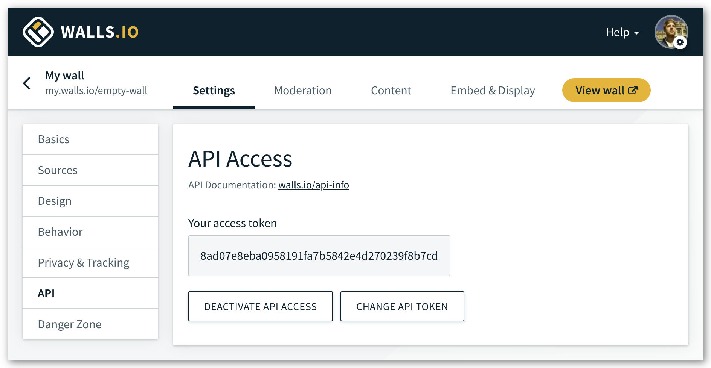

# Access Token

All endpoints require a valid API access token which identifies a wall.

In order to use the Walls.io API for your Wall, you need to be on the [Premium plan].

[Premium plan]:https://walls.io/features-and-pricing

## Example

```bash
curl -X GET "https://api.walls.io/v1/posts?access_token=8ad07e8ba0958191fa7b5842e4d270239f8b7cd"
```

## Create an access token

You can create an access token in your wall's settings. 
Look for “API“ and click “Activate API access”.


